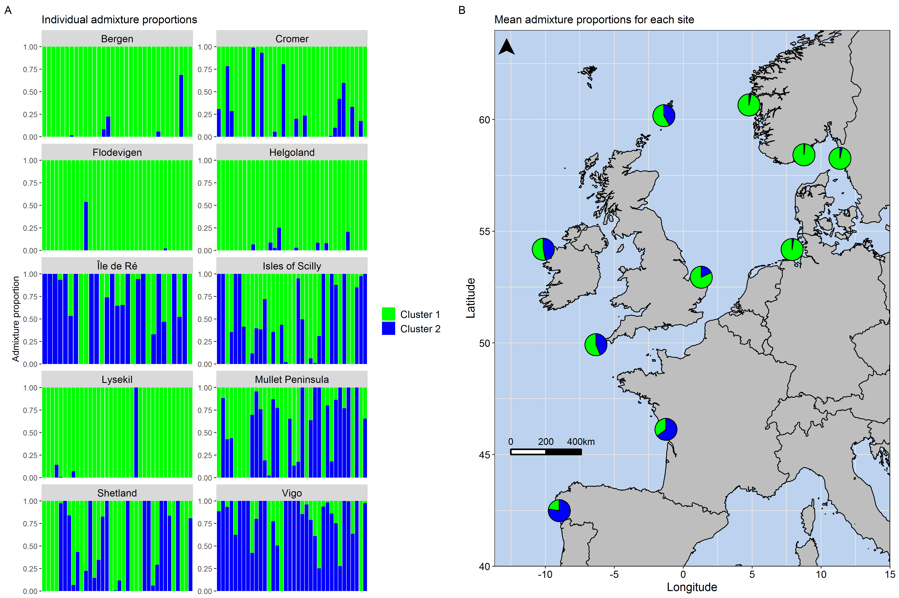

# Visualising admixture on a map using R
The scripts in this repository cover how to conduct STRUCTURE-like analyses in R using the R package LEA, how to visualise admixture proportions at both the individual and the population level, and how to plot admixture data as pie charts on a map. 

